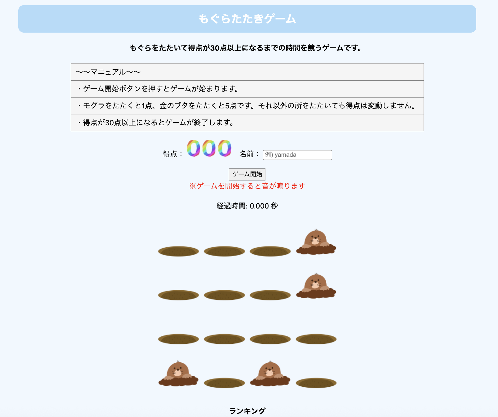
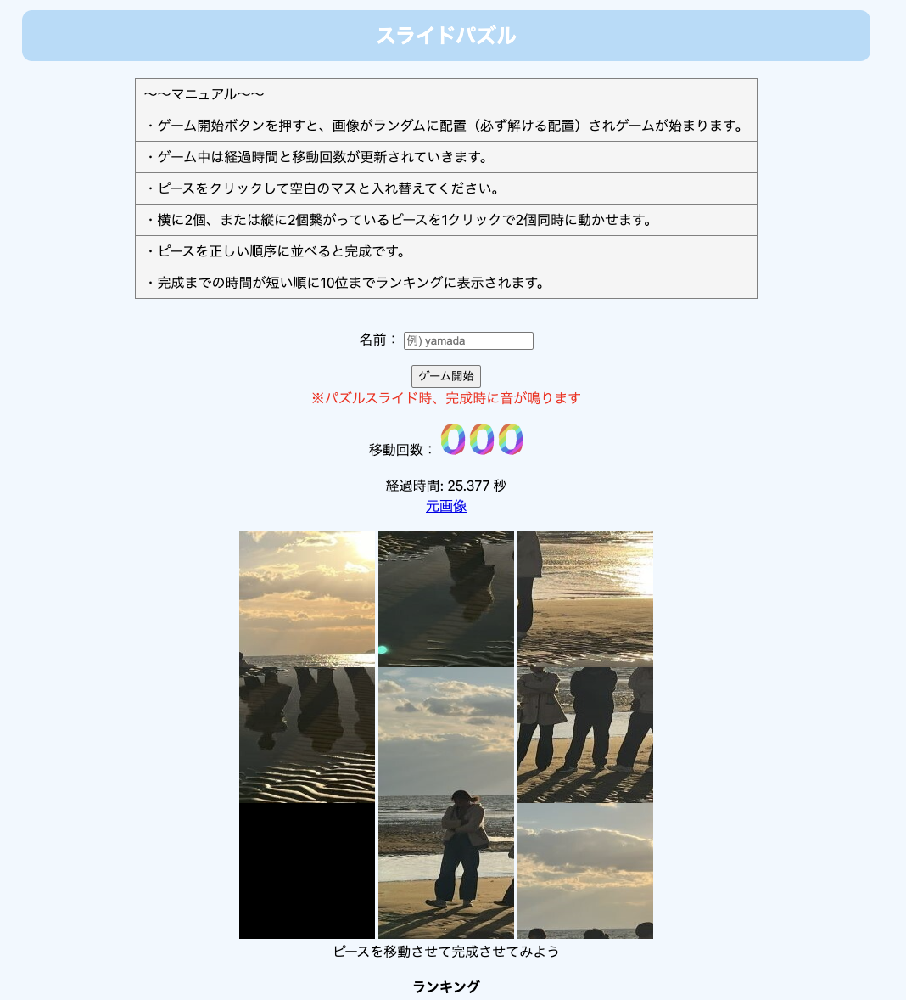
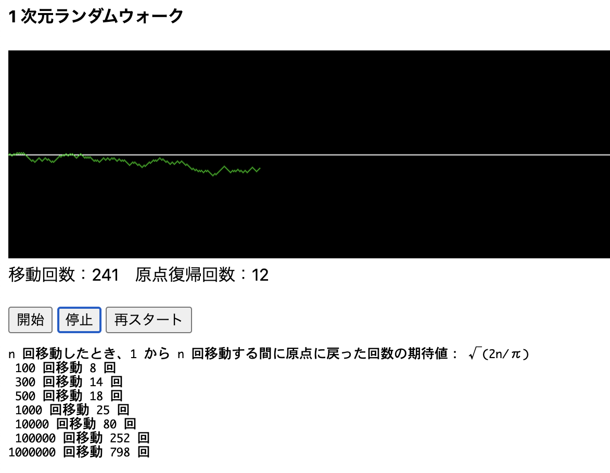
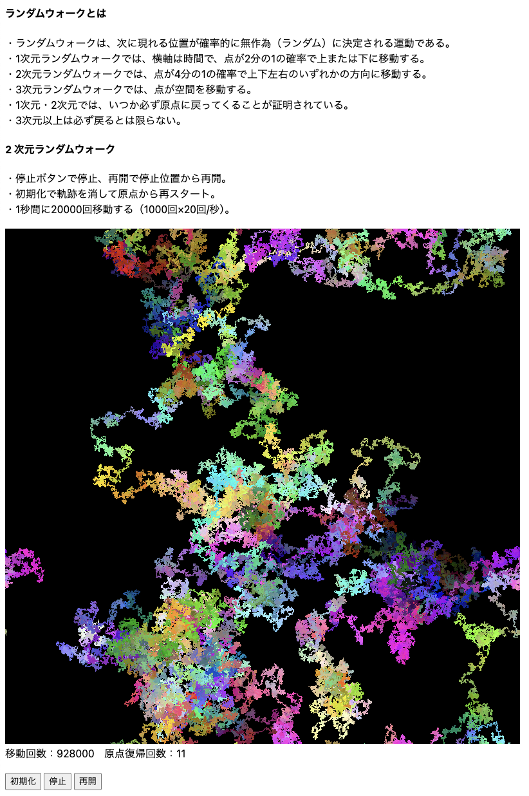
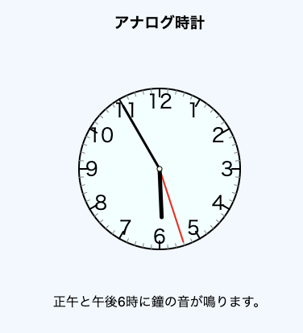
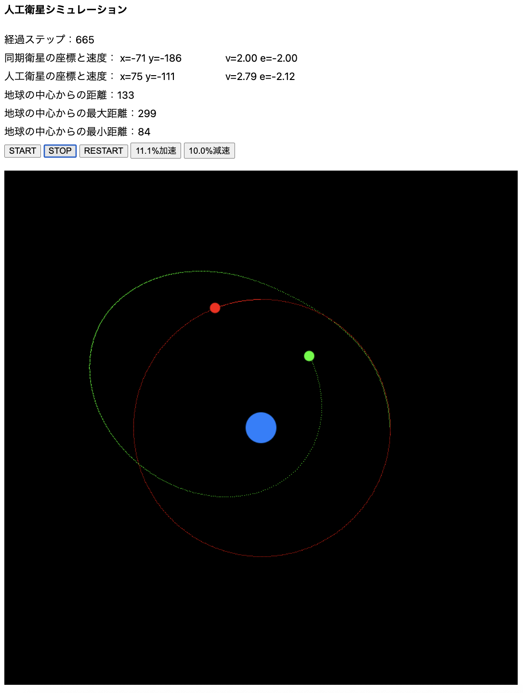
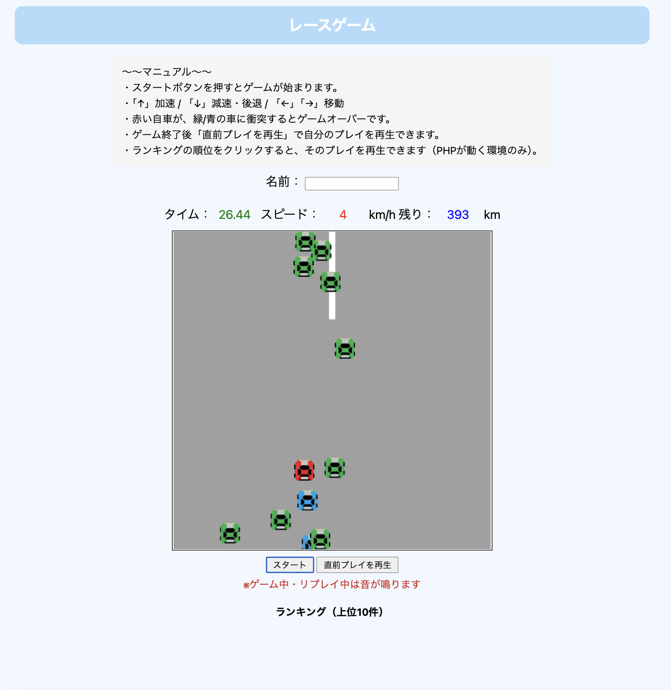

# Web_Programming
- [モグラ叩きゲーム](https://murakami-shogo.github.io/Web_Programming/Whack-a-Mole/index.html)

- [スライドパズル](https://murakami-shogo.github.io/Web_Programming/Slide-Puzzle/slide-puzzle.html)

- [1次元ランダムウォーク](https://murakami-shogo.github.io/Web_Programming/Canvas-Simulations/random-walk-1d.html)

- [2次元ランダムウォーク](https://murakami-shogo.github.io/Web_Programming/Canvas-Simulations/random-walk-2d.html)

- [アナログ時計](https://murakami-shogo.github.io/Web_Programming/Canvas-Simulations/analog-clock.html)

- [人工衛星シミュレーション](https://murakami-shogo.github.io/Web_Programming/Canvas-Simulations/satellite-simulation.html)

[レースゲーム](https://murakami-shogo.github.io/Web_Programming/Racing-Game/index.html)

## モグラ叩きゲーム
[モグラ叩きゲーム](https://murakami-shogo.github.io/Web_Programming/Whack-a-Mole/index.html)

モグラ叩きゲームです。  
もぐら（+1点）と金のブタ（+5点）を叩き、**合計30点に到達するまでのタイム**を競います。  

#### デモ（スクリーンショット）

## スライドパズル
[スライドパズル](https://murakami-shogo.github.io/Web_Programming/Slide-Puzzle/slide-puzzle.html)

ブラウザで遊べる3×3のスライドパズルです。  
ピースをスライドして元画像が完成するまでの **経過時間** を競います。  

### 遊び方
- 「ゲーム開始」ボタンを押すと、必ず解ける配置でゲームが始まります
- ピースをクリックして空白と入れ替えます
- 横または縦に2マス分つながっているピースは、1クリックで2枚同時にスライドできます
- 完成するとタイムが記録されます

#### デモ（スクリーンショット）

## Canvas-Simulations
描画・アニメーション・シミュレーション系のミニプロジェクト集です。

### 1次元ランダムウォーク
[1次元ランダムウォーク](https://murakami-shogo.github.io/Web_Programming/Canvas-Simulations/random-walk-1d.html)

点が確率的に上下へ移動し、原点復帰回数を表示します。

#### デモ（スクリーンショット）

### 2次元ランダムウォーク
[2次元ランダムウォーク](https://murakami-shogo.github.io/Web_Programming/Canvas-Simulations/random-walk-2d.html)

点が上下左右に移動し、軌跡を描画します。  

#### デモ（スクリーンショット）

### アナログ時計
[アナログ時計](https://murakami-shogo.github.io/Web_Programming/Canvas-Simulations/analog-clock.html)

時計を描画し、正午と午後6時に鐘の音が鳴ります。

#### デモ（スクリーンショット）

### 人工衛星シミュレーション
[人工衛星シミュレーション](https://murakami-shogo.github.io/Web_Programming/Canvas-Simulations/satellite-simulation.html)

重力下での衛星運動を描画し、距離・速度・エネルギーを表示します。

#### デモ（スクリーンショット）

## レースゲーム
[レースゲーム](https://murakami-shogo.github.io/Web_Programming/Racing-Game/index.html)

簡易レースゲームです。  
矢印キーで操作し、**ゴールまでのタイム**を競います。  
プレイ内容（キー入力ログ）を保存し、ランキング上位のプレイを再生できます。

### 操作
- ↑：加速
- ↓：減速・後退
- ← / →：左右移動
- 緑/青の車に衝突するとゲームオーバー

> ※ランキング保存・ランキング再生は PHP が動く環境が必要です（GitHub Pages では PHP が動きません）

#### デモ（スクリーンショット）
